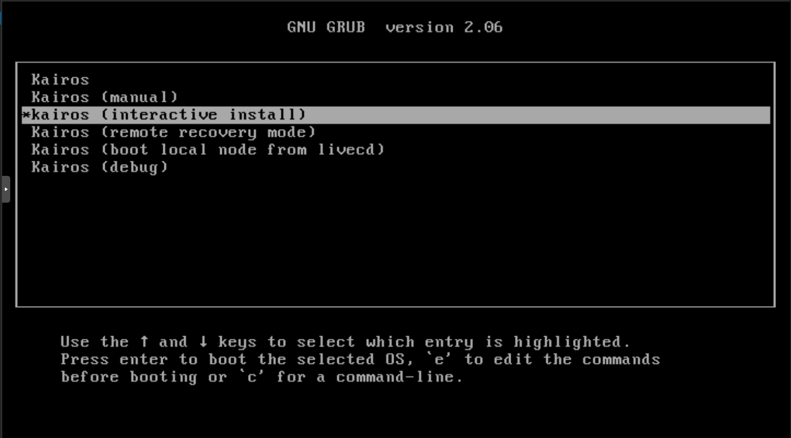
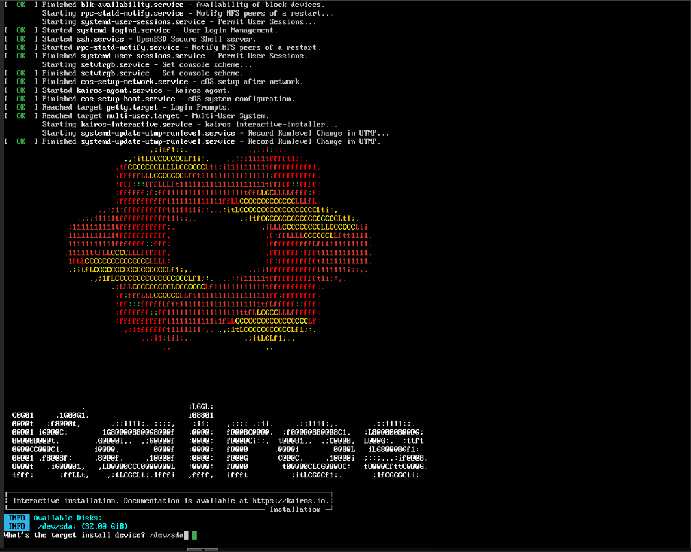
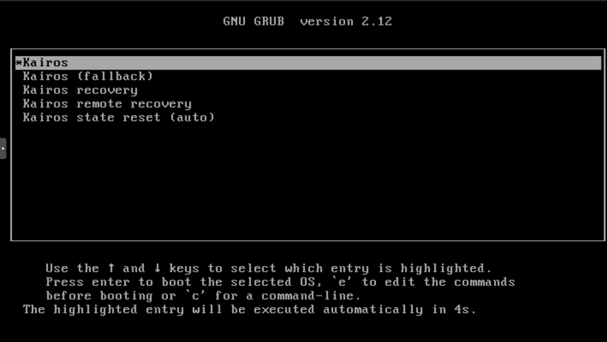

title = "Using SpinKube on Kairos"
description = "A guide showing how to install the SpinKube bundle on Kairos"
date = "2024-12-10T00:00:00.000000Z"
template = "blog"
tags = ["spinkube", "kairos", "edge", "immutable"]

[extra]
author = "Andrew Steurer"
author_image = "/static/image/profile/andrew-steurer.jpg"
type = "post"
twitter_card_type = "summary_large_image"
image = "/static/image/twc-kairos-spinkube.png"
category = "guide"
# ^ choose one of these categories [announcement|community|product|industry|guide]

---

This is a guide that will help you get started running Spin applications on Kairos.

## What is SpinKube?

[SpinKube](https://spinkube.dev) is is an open source project that makes it easy to run WebAssembly applications on Kubernetes. If you're new to WebAssembly, I recommend taking a look at the introduction to [Spin](https://developer.fermyon.com/spin/v3/index) (Fermyon's WebAssembly framework).

## What is Kairos

[Kairos](https://kairos.io/) is a Linux meta-distribution, which means it adds powerful features to distributions you are already familiar with. Here are some of the features it has to offer:
- **Container-based**: You can manage node configurations from an OCI container.
- **Immutable**: Certain paths of the system are not writable, which is helpful for keeping edge devices secure. Some parts of the system are layered over, so you can make 'runtime' changes that don't survive after a reboot.
- **Atomic Upgrades**: Partial upgrades are not allowed, which means predictable results for mass-updates.
- **Distribution-agnostic**: You can bring your own Linux distribution and convert it to Kairos.

## How to run SpinKube on Kairos

### How to run Kairos

There are lots of ways you can you can run Kairos, whether as a virtual machine, bare-metal, or even a pod in your Kubernetes cluster. If you are new to Kairos, I strongly recommend using a virtual machine management software like [ProxMox](https://www.proxmox.com/en/proxmox-virtual-environment/overview) or [VirtualBox](https://www.virtualbox.org/) and created a VM using a `.iso` image from the Kairos [release page](https://github.com/kairos-io/kairos/releases). For this demo, I used the [`kairos-ubuntu-24.04`](https://github.com/kairos-io/kairos/releases/download/v3.2.3/kairos-ubuntu-24.04-standard-amd64-generic-v3.2.3-k3sv1.31.2+k3s1.iso) image.

>>WARNING: SpinKube will not work with Kairos distributions that don't use systemd (i.e. Alpine).

### How to boot Kairos

When Kairos is initially booted, it will give you a few options for how to install Kairos. I recommend doing the interactive install:



Once you select the install method, after a while it will take you to a screen that looks like this:



You'll notice at the bottom it starts to ask you some configuration questions. For this demo, I recommend that you match my configuration:

- **What's the target install device?**
    - Use the default value
- **Do you want to create any users? If not, system will not be accessible via terminal or ssh**
    - Use the default value
- **User to setup**
    - Use the default value
- **Password**
    - Input a password you will remember
- **SSH access (rsakey, github/gitlab supported, comma-separated)**
    - Input `github:username`, `gitlab:username`, and/or `rsakey:YOUR_RSA_PUB_KEY`
- **Make the user an admin (with sudo permissions)?**
    - Use the default value
- **Do you want to setup a full mesh-support?**
    - Use the default value
- **Do you want to enable k3s?**
    - Use the default value
- **Are settings ok?**
    - Input `y`


Once you finish and press `enter`, the system will need a moment to configure. After it's finished, it will display `# _` where you will then run `sudo reboot`. When it reboots and reaches the `GNU GRUB` screen, select the first option:



Congrats! You successfully installed Kairos.

### How to run SpinKube on Kairos

SSH into your Kairos node, and create the file `/usr/local/cloud-config/config.yaml` with the following:

```yaml
#cloud-config

k3s:
    enabled: true

spinkube:
    installCertManager: true
```

This will initialize [K3S](https://k3s.io/) (a lightweight Kubernetes distribution), and will configure the Kairos SpinKube bundle we will install in a moment.

When the file is created, reboot your node.

Once the node is finished rebooting, run the command below to install the SpinKube bundle on K3S:
```sh
sudo kairos-agent install-bundle run://quay.io/kairos/community-bundles:spinkube_latest
```

Congrats! SpinKube is now running on your K3S node.

### Testing the configuration

You can test the configuration on your node by creating a SpinApp manifest `spin_app.yaml`:
```yaml
apiVersion: core.spinkube.dev/v1alpha1
kind: SpinApp
metadata:
  name: spin-app
spec:
  image: "ghcr.io/spinkube/spin-operator/hello-world:20241125-155422-g07a3175"
  replicas: 1
  executor: containerd-shim-spin
```

Once the `.yaml` file is created, run `sudo k3s kubectl apply -f spin_app.yaml`.

After a moment, you can run `sudo k3s kubectl get pods` which will show a pod named `spin-app` running in K3S.

### Final thoughts

SpinKube is a powerful solution for edge computing because it combines the efficiency of WebAssembly with the high-availability of Kubernetes. Add these on top of the security and flexibility of Kairos, and you have resilient applications that can be tailored to the dynamic requirements of edge environments.